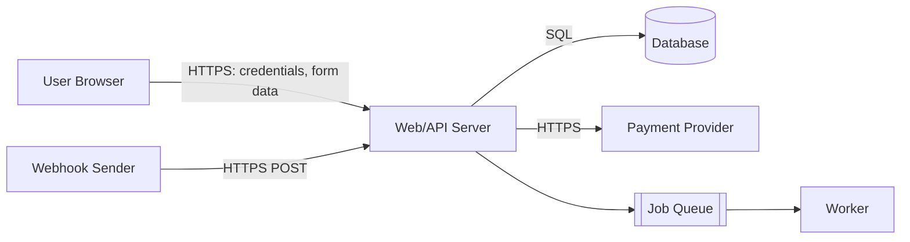

# Threat Model: <feature or system name>

- **Author(s)**: <who>
- **Date**: <YYYY-MM-DD>
- **Status**: Draft | Reviewed | Accepted
- **Scope**: <one sentence: what is in scope, what is explicitly out>
- **Revisit by**: <date — threat models expire when the architecture changes>

## 1. System Diagram

Sketch the data flow. A text diagram is fine — the point is the arrows, not the art.
Answer these prompts, then draw:

- Who are the **actors**? (end user, admin, third-party service, cron/queue worker)
- What are the **processes**? (web app, API, background jobs)
- What are the **data stores**? (database, object storage, cache, logs)
- What are the **external services**? (payment provider, email, OAuth IdP, webhooks in/out)
- Which arrows carry **sensitive data**? Mark them.

Replace the example above with your system.

## 2. Trust Boundaries

A trust boundary is any arrow where privilege, ownership, or trust level changes.
Common ones — keep the rows that apply, add your own:

| ID | Boundary | Less-trusted side | More-trusted side | Data crossing |
|----|----------|-------------------|-------------------|---------------|
| TB1 | Browser → API | Anonymous/authenticated user | App server | Credentials, user input, file uploads |
| TB2 | API → Database | App code | Data store | Queries built from user input |
| TB3 | Third party → API (webhooks) | External service | App server | Event payloads, signatures |
| TB4 | API → Third party | App server | External service | API keys, PII sent outbound |
| TB5 | User input → Background worker | Queued user data | Worker with elevated access | Deferred processing of untrusted data |
| TB6 | <add> | | | |

## 3. STRIDE per Boundary

For each boundary, ask the six STRIDE prompts. Not every cell needs an entry —
"n/a" is a valid, useful answer. Give each real threat an ID (T1, T2, ...).

**Prompts:**
- **S — Spoofing**: Could someone pretend to be another user/service here? How is identity proven?
- **T — Tampering**: Could data be modified in transit or at rest across this boundary?
- **R — Repudiation**: If something bad happens here, could the actor deny it? Is it logged?
- **I — Information disclosure**: What leaks if this boundary fails? Errors, logs, timing?
- **D — Denial of service**: Can this boundary be flooded or made expensive per-request?
- **E — Elevation of privilege**: Could the less-trusted side gain the more-trusted side's powers?

| Boundary | S | T | R | I | D | E |
|----------|---|---|---|---|---|---|
| TB1 Browser → API | T1: <e.g., credential stuffing on login> | T2: <e.g., tampered hidden form fields> | <logged?> | T3: <e.g., verbose error pages> | T4: <e.g., unthrottled expensive endpoint> | T5: <e.g., IDOR on object IDs> |
| TB2 API → Database | | T6: <e.g., SQL injection via raw query> | | | | |
| TB3 Webhooks → API | T7: <e.g., forged webhook, no signature check> | | | | | |
| TB4 API → Third party | | | | T8: <e.g., PII over-shared outbound> | | |
| TB5 Input → Worker | | | | | | |

## 4. Risk Ranking

Score each threat: **Impact** (1 = annoyance, 2 = serious for some users, 3 = breach/outage/company-level)
× **Likelihood** (1 = needs insider or luck, 2 = skilled attacker, 3 = scriptable/automated).
Sort descending. Don't debate decimals — this is a sorting exercise.

| Threat ID | Description | Impact (1-3) | Likelihood (1-3) | Score | Decision |
|-----------|-------------|--------------|------------------|-------|----------|
| T5 | <IDOR on order IDs> | 3 | 3 | 9 | Mitigate |
| T6 | <SQLi in reporting raw query> | 3 | 2 | 6 | Mitigate |
| T1 | <credential stuffing> | 2 | 3 | 6 | Mitigate |
| T3 | <stack traces in prod errors> | 1 | 2 | 2 | Accept |

Decision values: **Mitigate** (build a fix), **Accept** (documented, with owner + revisit date),
**Transfer** (handled by provider/insurance), **Eliminate** (remove the feature/data).

## 5. Mitigation Tracking

Every "Mitigate" row above gets a row here. Every "Accept" gets an owner and a revisit date.

| Threat ID | Mitigation | Owner | Ticket | Status | Verified how |
|-----------|-----------|-------|--------|--------|--------------|
| T5 | Server-side ownership check on all order endpoints; 404 on mismatch | <name> | <link> | Todo / In progress / Done | ID-swap test in integration suite |
| T6 | Replace raw query with parameterized version | <name> | <link> | Todo | Code review + sqlmap-free grep for raw() |
| T1 | Rate limit login 10/min/IP + per-account backoff; MFA offered | <name> | <link> | Todo | Manual throttle test |

### Accepted Risks

| Threat ID | Why accepted | Owner | Revisit by |
|-----------|--------------|-------|------------|
| T3 | Low impact; generic error pages planned in Q3 | <name> | <date> |

## 6. Assumptions and Out of Scope

List what this model assumes true (e.g., "TLS terminates at the load balancer and is configured
correctly", "the cloud provider's physical security is trusted"). If an assumption breaks,
the model needs a rerun.

- <assumption 1>
- <out of scope: e.g., insider threats, physical access>
